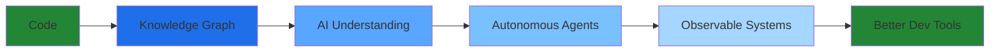

<div align="center">

# ANAND B

**Making AI Systems Observable & Debuggable**

Building graph-native intelligence for autonomous agents

[`@RXffofc`](https://twitter.com/RXffofc) • [`anandbiju71@gmail.com`](mailto:anandbiju71@gmail.com)

</div>

---

<div align="center">

## ⚡ LIVE CODING UNIVERSE

```diff
███████████████████████████████████████████████████████████████████
█                                                                 █
█   🌌  REPOSITORY CONSTELLATION - Your Code Galaxy Live         █
█                                                                 █
███████████████████████████████████████████████████████████████████

        ⭐                    🌟                    ✨
     Arbor                Hive-Mind           Agent-Lens
   [Rust Core]          [TypeScript]          [Python]
      ↓                      ↓                     ↓
      
█████▓▓▓▒▒▒░░░ GRAPH INTELLIGENCE LAYER ░░░▒▒▒▓▓▓█████

         🛸 Currently Orbiting: Graph-Native AI
         🎯 Mission: Autonomous Agent Observability
         📊 Systems Online: 6 Active Repositories
         
███████████████████████████████████████████████████████████████████
```

</div>

---

## 🎯 CORE SYSTEMS

<table>
<tr>
<td width="50%" valign="top">

**🌳 [ARBOR](https://github.com/Anandb71/arbor)**

The Graph-Native Intelligence Layer

```rs
fn transform_codebase() {
    Code → Knowledge Graph
         → Queryable
         → MCP Compatible
}
```

Transform entire codebases into intelligent, queryable knowledge graphs. Built for the next generation of AI development tools.

**Tech:** `Rust` `Graph DB` `MCP`

</td>
<td width="50%" valign="top">

**🧠 [HIVE-MIND](https://github.com/Anandb71/Hive-Mind-v1-)**

Multi-Agent Collaborative IDE

```ts
interface AgentSwarm {
  agents: AIAgent[];
  collaborate: () => Solution;
  observe: () => Insights;
}
```

Multiple AI agents work together inside your editor. Watch them reason, collaborate, and solve complex problems in real-time.

**Tech:** `TypeScript` `VS Code API` `Multi-Agent`

</td>
</tr>
<tr>
<td width="50%" valign="top">

**🔍 [AGENT LENS 2.0](https://github.com/Anandb71/Agent-lens-2.0)**

Visual Debugger for AI Agents

```py
with AgentLens() as lens:
    lens.observe(workflow)
    lens.visualize(decisions)
    lens.debug(reasoning)
```

Local-first debugging for LangChain & CrewAI. See inside the black box - watch agent reasoning unfold step by step.

**Tech:** `Python` `LangChain` `CrewAI`

</td>
<td width="50%" valign="top">

**📈 [FINX V2](https://github.com/Anandb71/finx_v2)**

Stock Trading Simulator

```dart
class Trading {
  learn() => practice();
  practice() => profit();
  // No real money lost
}
```

Master trading strategies with virtual money and real market data. Gamified financial education that actually teaches.

**Tech:** `Flutter` `Real-time APIs` `ML`

</td>
</tr>
</table>

<details>
<summary><b>📦 MORE SYSTEMS</b></summary>

<br>

| Repository | Purpose | Stack |
|:-----------|:--------|:------|
| **[AI2util Bot](https://github.com/Anandb71/AI2util-discord-bot)** | Autonomous Discord agent with full task execution capabilities | `Python` `Async` |
| **[NutriOrb](https://github.com/Anandb71/Nutriorb)** | AI-powered nutrition tracking with fluid UI design | `Flutter` `ML` |
| **[RunCat365](https://github.com/Anandb71/RunCat365)** | Windows taskbar cat with GPU heat mapping | `C#` `.NET` |
| **[TraZero](https://github.com/Anandb71/TraZero)** | Real-time carbon footprint tracking | `Dart` |

</details>

---

## 🛠️ TECH STACK

```yaml
Languages:
  Primary: [Rust, Python, TypeScript]
  Secondary: [C++, Java, Dart, C#]

Frameworks:
  AI: [LangChain, CrewAI, MCP Protocol]
  Frontend: [React, Next.js, Flutter]
  Backend: [Node.js, FastAPI]

Focus:
  - Graph-Native Intelligence
  - Autonomous Agent Systems
  - Local-First Architecture
  - Observable AI Workflows
  - Developer Experience
```

---

## 📊 SYSTEM METRICS

<div align="center">


</div>

<div align="center">

```ascii
CONTRIBUTION INTENSITY MAP
─────────────────────────────────────────────────────────
🟩 High Activity    🟦 Medium Activity    ⬜ Learning Phase
─────────────────────────────────────────────────────────
```

</div>

---

## 🎯 CURRENT MISSION

<div align="center">



**Building the observability layer for the next generation of AI systems**

</div>

---

<div align="center">

### 💭 Philosophy

*"The best AI systems are the ones you can understand,*  
*debug when they fail, and trust when they work."*

---

**[View All Repositories →](https://github.com/Anandb71?tab=repositories)**

⚡ Building in public • 🌱 Always learning • 🚀 Shipping fast

</div>
