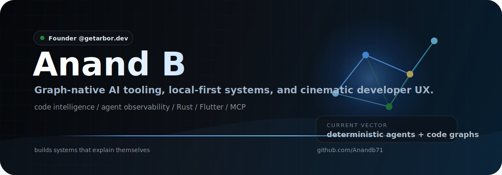

<div align="center">



**Founder - [www.getarbor.dev](https://www.getarbor.dev/)**

<br />


</div>

## Arbor

I build **Arbor**, graph-native code intelligence for AI agents and engineering teams. It maps real program structure so agents can reason with call paths, blast radius, Git diffs, and MCP tools instead of guessing.

```text
code graphs -> impact analysis -> MCP context -> safer AI coding
```

## Selected Builds

| Project | Focus |
| --- | --- |
| [Arbor](https://github.com/Anandb71/arbor) | Graph-native code intelligence. |
| [LoRA-JIT](https://github.com/Anandb71/LoRA-jit) | Local adapter routing for code generation. |
| [Agent Lens 2.0](https://github.com/Anandb71/Agent-lens-2.0) | Visual debugging for AI agents. |
| [J.A.R.V.I.S.](https://github.com/Anandb71/J.A.R.V.I.S) | Desktop AI assistant. |
| [FinShield](https://github.com/Anandb71/FinShield) | Financial document forensics. |
| [witr](https://github.com/Anandb71/witr) | Process and service diagnostics. |

## Stats

<div align="center">
  
  
</div>

<div align="center">
  
  
</div>

## Links

[All repositories](https://github.com/Anandb71?tab=repositories) / [Arbor](https://www.getarbor.dev/) / [Email](mailto:anandbiju71@gmail.com) / [X](https://twitter.com/RXffofc)
