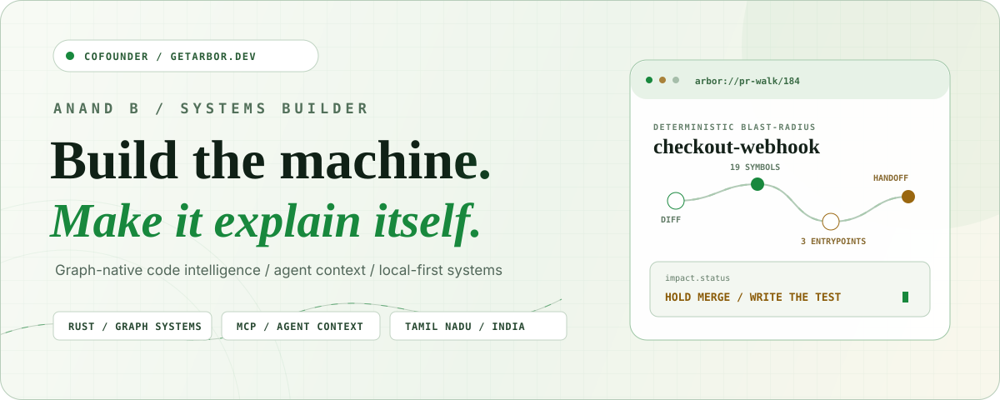
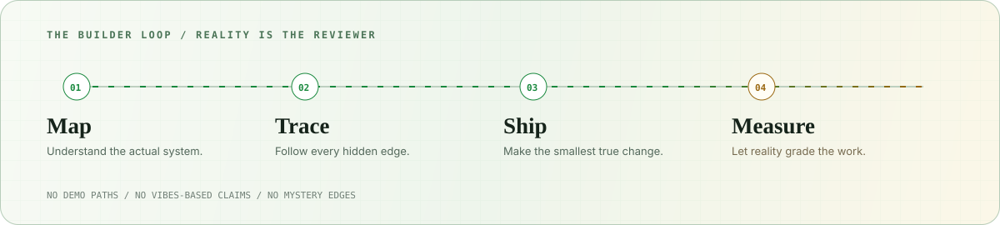

<picture>
  <source media="(prefers-color-scheme: dark)" srcset="./assets/profile-hero-dark.svg">
  <source media="(prefers-color-scheme: light)" srcset="./assets/profile-hero-light.svg">
  
</picture>

 

## I build the parts AI coding agents are still missing.

I am **Anand B** - Co-Founder at [Arbor](https://www.getarbor.dev/), computer science student at VIT Vellore, and a systems builder obsessed with making complex software legible.

My main bet is [**Arbor**](https://github.com/getArbor-dev/arbor): graph-native code intelligence that maps a repository with ASTs, walks the real call paths behind a pull request, and gives humans and coding agents the exact blast radius before merge.

> The same commit should produce the same answer. Deterministic context beats plausible guesswork.

## Live builder signal

<picture>
  <source media="(prefers-color-scheme: dark)" srcset="https://raw.githubusercontent.com/Anandb71/Anandb71/output/profile-signal-dark.svg">
  <source media="(prefers-color-scheme: light)" srcset="https://raw.githubusercontent.com/Anandb71/Anandb71/output/profile-signal-light.svg">
  
</picture>

Generated every day by a pinned GitHub Action. No request-time stats API, no sleeping dyno, and the last good card survives a failed refresh.

## Selected work

<table>
  <tr>
    <td width="50%" valign="top">
      <h3><a href="https://github.com/getArbor-dev/arbor">01 / Arbor</a></h3>
      
<strong>The map AI coding agents are missing.</strong>

      
A Rust graph engine, PR blast-radius system, and MCP context layer built around deterministic program understanding instead of embedding-based RAG.

      
<code>Rust</code> <code>ASTs</code> <code>Call Graphs</code> <code>MCP</code>

    </td>
    <td width="50%" valign="top">
      <h3><a href="https://github.com/Anandb71/Bleurs">02 / Bleurs</a></h3>
      
<strong>Ground truth for APIs used by coding agents.</strong>

      
Blocks the APIs that do not exist and serves the ones that do - one index, queried in both directions.

      
<code>Python</code> <code>Static Analysis</code> <code>Agent Safety</code>

    </td>
  </tr>
  <tr>
    <td width="50%" valign="top">
      <h3><a href="https://github.com/Anandb71/LoRA-jit">03 / LoRA-JIT</a></h3>
      
<strong>Structural weight paging for consumer GPUs.</strong>

      
Experiments in local adapter routing, just-in-time model state, and the telemetry needed to know when the system is actually winning.

      
<code>Python</code> <code>Local AI</code> <code>GPU Systems</code>

    </td>
    <td width="50%" valign="top">
      <h3><a href="https://github.com/Anandb71/Legion-LOQ-control">04 / Legion + LOQ Control</a></h3>
      
<strong>A safer, bloat-free Lenovo Vantage replacement.</strong>

      
A Windows-first control plane with read-only discovery, explicit capability evidence, and a short-lived elevated broker for guarded hardware access.

      
<code>C#</code> <code>.NET 10</code> <code>WPF</code> <code>Windows</code>

    </td>
  </tr>
</table>

  
<strong>More systems from the lab</strong>

   

- [**Runoscope**](https://github.com/Anandb71/Runoscope) - the portable HAR file for AI coding-agent runs.
- [**Agent Lens 2.0**](https://github.com/Anandb71/Agent-lens-2.0) - visual debugging for agent workflows.
- [**Zubaan**](https://github.com/Anandb71/Zubaan) - live multilingual compliance checks for Indian financial sales.
- [**FinShield**](https://github.com/Anandb71/FinShield) - financial document forensics and graph investigation.
- [**witr**](https://github.com/Anandb71/witr) - process, port, and service causality diagnostics.

## The builder loop

<picture>
  <source media="(prefers-color-scheme: dark)" srcset="./assets/builder-loop-dark.svg">
  <source media="(prefers-color-scheme: light)" srcset="./assets/builder-loop-light.svg">
  
</picture>

I optimize for `determinism over vibes`, `local-first over rented black boxes`, `instrumentation before optimization`, and `safety gates before privileged writes`.

## Contribution graph

<picture>
  <source media="(prefers-color-scheme: dark)" srcset="https://raw.githubusercontent.com/Anandb71/Anandb71/output/github-contribution-grid-snake-dark.svg">
  <source media="(prefers-color-scheme: light)" srcset="https://raw.githubusercontent.com/Anandb71/Anandb71/output/github-contribution-grid-snake.svg">
  
</picture>

## Working set

**Languages:** `Rust` `Python` `C# / .NET` `TypeScript` `Dart`

**Systems:** `AST parsing` `code graphs` `MCP` `agent observability` `local AI` `Windows internals`

**Default posture:** build deeply -> measure honestly -> ship relentlessly

---

### Every change has a reach. [See it before you merge.](https://www.getarbor.dev/)

<a href="https://github.com/Anandb71?tab=repositories">Repositories</a>
&nbsp;&middot;&nbsp;
<a href="https://www.linkedin.com/in/anandb71/">LinkedIn</a>
&nbsp;&middot;&nbsp;
<a href="https://x.com/RXffofc">X</a>
&nbsp;&middot;&nbsp;
<a href="mailto:anandbiju71@gmail.com">Email</a>

  

